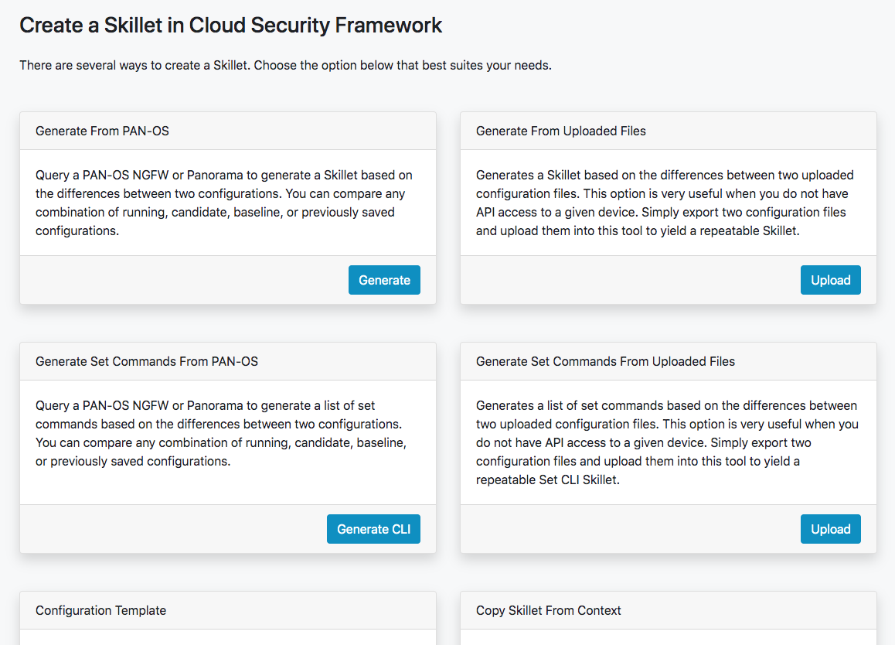
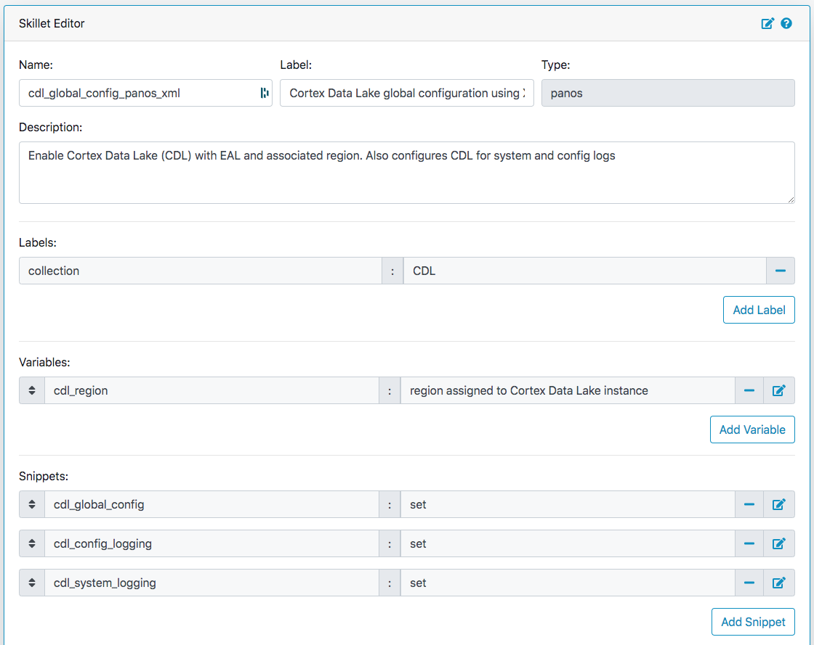
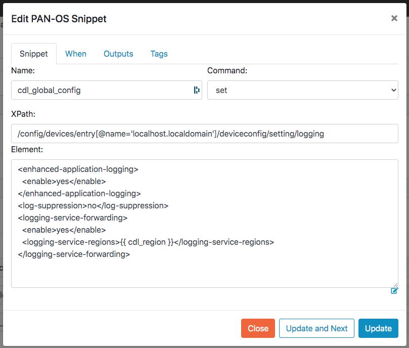

.. _creating_skillets_doc:

Creating and Editing Skillets
-----------------------------

In Panhandler 4.0, you now have the ability to generate Skillets dynamically. This feature
works by generating the difference between two saved configurations. These configurations
can the candidate, running, baseline, or any saved configuration. The currently
supported options for skillet generation are:

* Skillet from a running PAN-OS or Panorama instance using saved configurations or the running configuration
* Skillet from two exported configurations
* Set commands from a running PAN-OS or Panorama instance using saved configurations or the running configuration
* Set commands from two exported configurations
* Full Configuration template from a saved configuration

Skillet Editor
==============

The Skillet Editor allows you to copy, edit, create, and delete Skillets in a local branch
of a repository. The Editor allows GUI based editing of all aspects of a Skillet including
editing and ordering snippets, dynamically detecting variables, creating and ordering variables,
and updating the metadata.

The Skillet Editor currently supports the following skillet types:

* panos
* panorama
* pan-validation
* rest
* template

Other Tools
===========

If you prefer a CLI experience, check out `SLI <https://gitlab.com/panw-gse/as/sli>`_

For more information, see the `Skillet Builder <https://skilletbuilder.readthedocs.io/en/latest/>`_ documentation.