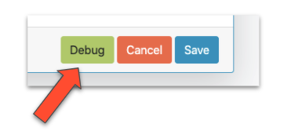
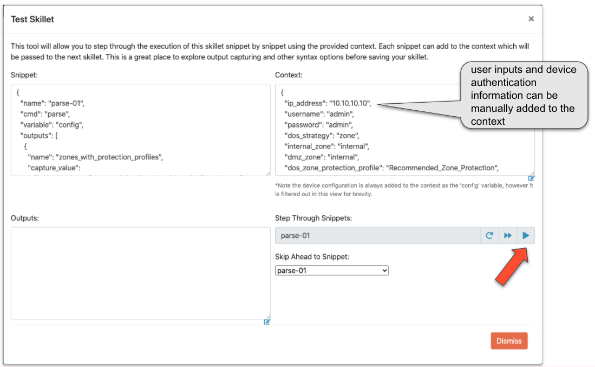

Creating and Debugging Validation Skillets
------------------------------------------

Panhandler allows you to edit and debug validation skillets using the Skillet Editor. See :ref:`creating_skillets_doc`.

From the repository details page, click the 'edit' control for the Skillet you want to edit.

.. image:: images/ph-edit-skillet.png

At the bottom of the Skillet Editor, click the 'Debug' button to enter the Skillet Debugger.

Skillet Debugger
----------------

The Skillet Debugger allows you to step through each snippet and see the context between steps. This is
especially useful to understand the various captures and filters available.

To use the debugger, manually enter Device connection information into the Context input. You may also edit
any defined variables here that may impact the skillet logic.

.. note:: Ensure the context input is valid JSON.

Click the 'play' button to execute the next snippet. The 'Outputs' will show the returned value from the snippet.
The 'Context' will also contain all captured values as well. This allows you to quickly experiment with various
capture_pattern, capture_list, capture_value, and filter_items options.

You may also use the 'Skip Ahead to Snippet' in order to test a specific snippet execution.

.. note:: Be sure you understand what variables a snippet requires in the context when skipping ahead. In some cases,
    you'll need play the snippets in order to get the proper context values in place.

Manual Debugging with SLI
~~~~~~~~~~~~~~~~~~~~~~~~~

`SLI <https://pypi.org/project/sli/>`_ is a command line interface to
`skilletlib <https://github.com/paloaltonetworks/skilletlib>`_ and offers
a great way to test and discover all the various features of skillets.

SLI makes it easy to quickly verify XPath queries, capture queries, and so on.

.. code-block:: bash

    # Test and output a capture_list that displays names of all decryption policies
    sli capture list  "/config/devices/entry[@name='localhost.localdomain']/vsys/entry/rulebase/decryption/rules/entry/@name"

    # Same as above, except this command will store the output to the default context in the variable "decryption_rules"
    sli capture -uc list "/config/devices/entry[@name='localhost.localdomain']/vsys/entry/rulebase/decryption/rules/entry/@name" decryption_rules

    # Capturing an object works similar to capturing a list
    sli capture object "/config/devices/entry[@name='localhost.localdomain']/vsys/entry/rulebase/decryption"

    # Capturing an expression allows further processing on data already stored in the context
    sli capture -uc expression "decryption_rules | json_query('[].entry[].category.member[]')"

    # Windows requires an additional escape character on double quotes, a ` is required in addition to the \
    sli capture -uc expression "decryption_obj | json_query('decryption.rules.entry[].\`"@name\`"')"

SLI is available on `Pypi.org <https://pypi.org/project/sli/>`_ and can be easily installed like this:

.. code-block:: bash

    pip install sli

Manual Debugging with Python
~~~~~~~~~~~~~~~~~~~~~~~~~~~~

In some cases, it may be desirable to use Python or a debugger like PyCharm or pdb for building your validation
skillet. Here is an example python script that will load a config file from the local filesystem and run a
skillet. You may use the 'filter_snippets' option to only run specified snippets as desired.

.. code-block:: python

    import json

    import click

    from skilletlib.skilletLoader import SkilletLoader

    @click.command()
    @click.option("-c", "--config_file", help="Local Config File", type=str, default="config.xml")
    @click.option("-d", "--skillet_dir", help="Skillet Directory", type=str, default=".")
    @click.option("-f", "--snippet_filter", help="Snippet Filter Type", type=str, default="")
    @click.option("-s", "--snippet_filter_value", help="Snippet Filter Value", type=str, default="")
    def cli(config_file, skillet_dir, snippet_filter, snippet_filter_value):
        sl = SkilletLoader()
        skillets = sl.load_all_skillets_from_dir(skillet_dir)
        d = skillets[0]

        context = dict()
        with open(config_file, 'r') as config:
            context['config'] = config.read()

        if snippet_filter != "":
            context['__filter_snippets'] = {
                snippet_filter: snippet_filter_value
            }

        out = d.execute(context)

        print('=' * 80)
        print(json.dumps(out, indent=4))
        print('=' * 80)

    if __name__ == '__main__':
        cli()

The above requires 'click' and 'skilletlib' to be installed. The output will contain all captured values
and filtered items in the 'outputs' key.

.. code-block:: bash

    pip install click
    pip install git+https://github.com/PaloAltoNetworks/skilletlib.git@develop#egg=skilletlib

For more information, see the `Skillet Builder <https://skilletbuilder.readthedocs.io/en/latest/>`_ documentation.