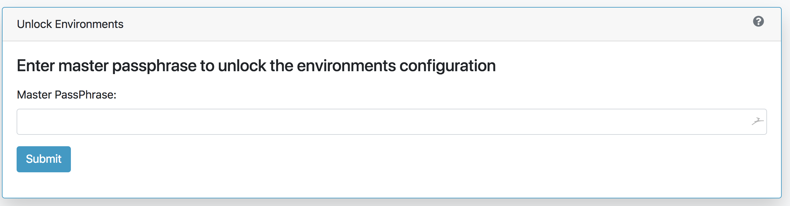
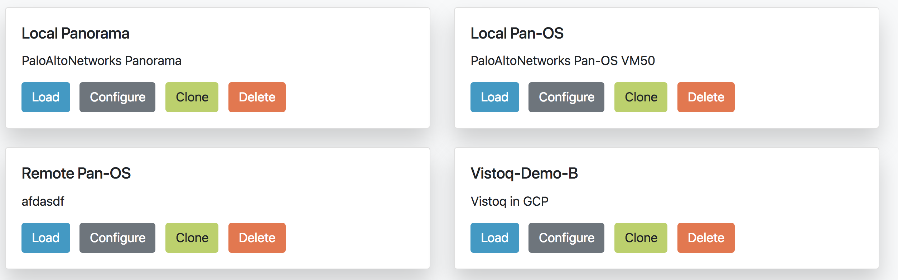

.. _environment_doc:

Panhandler Environments
=======================

Often times, it is desirable to store environment specific data outside of a git repository. Panhandler provides
a mechanism to do this using 'Environments'.

What is an Environment
-----------------------

An environment is a collection of secrets that can be loaded and managed as a unit. For example, you may want to keep
all AWS related secrets together in an environment called 'AWS'. When panhandler displays a web form from a configuration
set, any variables from the configuration template that share a name with a secret in the currently loaded environment,
that value will be pre-populated.

This is especially useful if you have multiple environments such as 'AWS-QA', 'AWS-PROD', and 'AWS-DEV'.

Unlocking Environments
----------------------

To load an environment, click on the 'lock' icon on the right of the navigation bar.

You will be presented with an unlock password dialog. This password will be used to protect any secrets you store
in your environments in an encrypted file in your home directory. If this encrypted file does not already exist it will
be created and protected with the password you enter here.

Once unlocked, you can manage your environments by creating new ones, cloning, configuring, or deleting existing ones.

Choosing the 'Configure' option on an environment allows you to add, remove, or overwrite secrets stored within them.

.. image:: images/ph-env-details.png

Choosing to 'Load' an environment makes that env available to pre-populate template fields. It will also be available
as a 'pop-over' that you can use to copy and paste secrets into template fields. This is useful when you want to
store secrets like API_KEYS

.. Note::
    Template variables that share the same 'name' as a secret in the currently loaded environment will be
    pre-populated with the value of that secret. You can find the exact name of a specific variable field
    by looking at the '.meta-cnc.yaml' file for that form.

