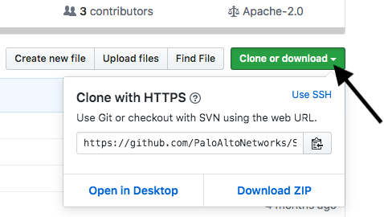
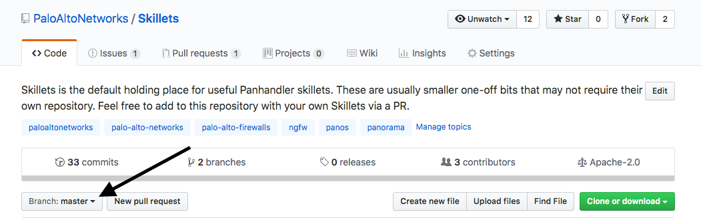
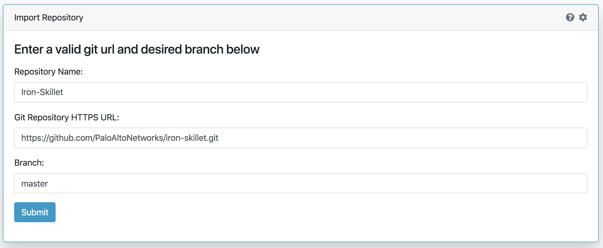
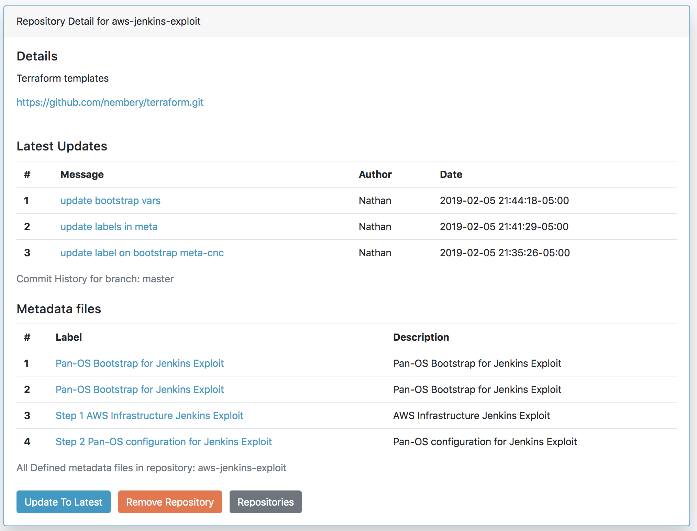
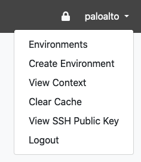

Adding a New Skillet Repository
-------------------------------

Panhandler is preloaded with a wide set of skillets yet you may still have to manually add skillet repos.

Import a New Skillet
~~~~~~~~~~~~~~~~~~~~

From the main menu, choose `Import Skillets`.

.. image:: images/ph-menu.png
    :width: 250

The import repository fields allow you to specify the repo name and URL to import. You may
import repositories from any git server, including GitHub, gitlab, gogs, etc.

To import a repository from Github, click on the 'Clone or Download' button and copy the full HTTPS link
shown.

.. warning::

    Private Repositories must use the SSH based URL. You must also import your Panhandler
    SSH Key into your private repository.

Also, note which branch you want to import. The list of available branches can be found in Github by clicking
the 'Branch: master' button on the main page of the repository.

Enter this information in the 'Import Skillets' form to import the repository and gain access to the
Skillets contained within.

Once successful, you will see the complete list of imported repositories including the newly added repo.

At this stage, going to the `Template Library` will show any additional skillets in their respective categories.

Update a Skillet Repository
~~~~~~~~~~~~~~~~~~~~~~~~~~~

From the main menu, choose `Repositories`.

.. image:: images/ph-menu.png
    :width: 250

Click on `Details` for the repository of interest.

The repo window will show a description of the repo along with the last few content changes.

Choose `Update to Latest` to check for and pull template updates.

.. Note::
    `Already up to date` will show that no changes were made to the source skillet and no udpates required.

Using a Private Git Repository
~~~~~~~~~~~~~~~~~~~~~~~~~~~~~~

In order to use private repositories, you must first import the Panhandler public SSH key
into your upstream repository or account.

Use the 'View SSH Public Key' option in the user menu to see the autogenerated key for Panhandler.

Instructions for importing this key into your repository can be found here:

- `GitHub <https://help.github.com/en/github/authenticating-to-github/adding-a-new-ssh-key-to-your-github-account>`_
- `GitLab <https://docs.gitlab.com/ee/ssh/#adding-an-ssh-key-to-your-gitlab-account>`_
- `BitBucket <https://confluence.atlassian.com/bitbucket/access-keys-294486051.html>`_
- `Others <https://duckduckgo.com/?q=add+SSH+key+to+git+repository&t=ffab&ia=web>`_

.. warning::
    You must use the SSH based git URL when importing your private repository as HTTPS authentication
    is not supported!

