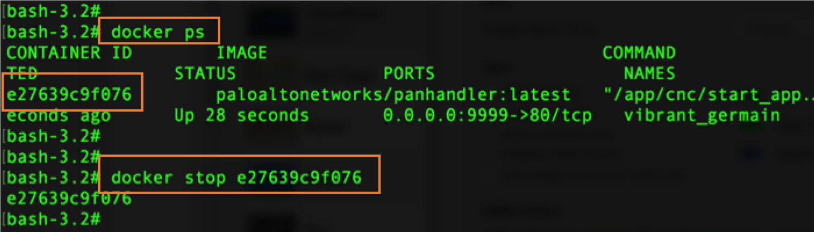

Running Panhandler
==================

The recommended way to run panhandler is to pull and run the docker container.

Running the Panhandler Docker Container
---------------------------------------

To get the latest version of panhandler as a docker container.

Using a standard web port
~~~~~~~~~~~~~~~~~~~~~~~~~

.. code-block:: bash

    docker run -p 80:80 paloaltonetworks/panhandler

Then access the UI via http://localhost:80

The default username and password is: `paloalto` and `panhandler`

Using an alternate TCP port
~~~~~~~~~~~~~~~~~~~~~~~~~~~

If port 80 is unavailable, you can switch to a different port. This example uses port 9999.

.. code-block:: bash

    docker run -p 9999:80 paloaltonetworks/panhandler

Then access the UI via http://localhost:9999

Stopping the docker container
~~~~~~~~~~~~~~~~~~~~~~~~~~~~~

The docker container runs in the background. You can stop the container by using its container ID.

.. code-block:: bash

    docker ps
    docker stop { CONTAINER ID }

.. Note::
    If you need to remove the container, enter `docker rm { CONTAINER ID }` with CONTAINER ID as the
    ID used to stop. You must stop the container before deleting.

Building Panhandler
-------------------

If you want to build panhandler from source (which is not recommended). You will need to update the git submodules,
install the pip python requirements for both the app and also CNC, create the local db, and create a local user.

.. code-block:: bash

    git clone https://github.com/PaloAltoNetworks/panhandler.git
    cd panhandler
    git submodule init
    git submodule update
    pip install -r requirements.txt
    pip install -r cnc/requirements.txt
    ./cnc/manage.py migrate
    ./cnc/manage.py shell -c "from django.contrib.auth.models import User; User.objects.create_superuser('paloalto', 'admin@example.com', 'panhandler')"

Running Panhandler manually
---------------------------

To start the application on your local machine on port 80:

.. code-block:: bash

    cd panhandler/cnc
    celery -A pan_cnc worker --loglevel=info
    manage.py runserver 80

To use a different port, supply a different argument to the runserver command above. In this case, the server will
start up on port 80. Browse to http://localhost in a web browser to begin. The default login credentials are 'paloalto'
and 'panhandler'

Requirements
------------

Panhandler has been tested to work on Docker version: 18.09.1 (Mac) and 18.09.0 (Linux).
Please ensure you have the latest docker version installed for the best results.

