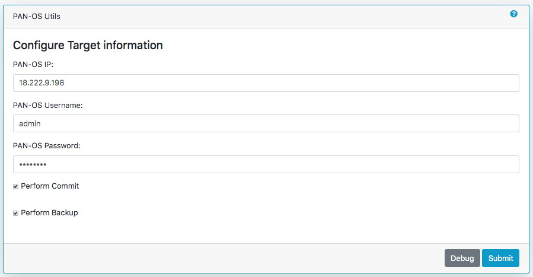
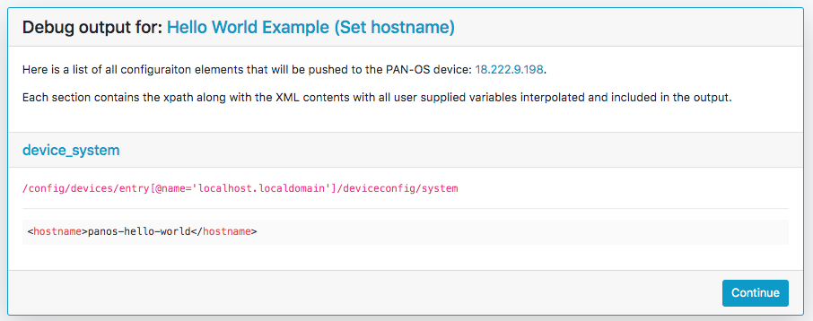

Using Panhandler
================

Once installed and running, use your web browser to access panhandler.

Access the web portal
---------------------

For your local device:

    http://localhost:80  (for a standard web port)

    http://localhost:9999 (using a defined port, eg. 9999)

The default username and password is: `paloalto` and `panhandler`

Set the Configuration Target
----------------------------

Before choosing skillets to load, set the configuration target IP and username/password credentials. This stores the
device credentials to be used for API access.

Jump to :ref:`environment_doc` to set the environment.

Choose Skillets to View by Collection
--------------------------------------

From the main panhandler menu, select `Skillet Collections` to see available Skillet Collections. A collection
is a group of Skillets.

.. image:: images/ph-menu.png
    :width: 250

Select `Go` on the card for the desired collection to see all Skillets that belong to that collection. Any
Skillet builder can create their own collection.

Select the Skillet to Load
---------------------------

A list of templates will be available to load into your device. Select the desired item and enter the form data.

.. image:: images/ph-example-skillet.png

The final form will be the target information for API config loading. Confirm the correct values and submit.

For PAN-OS types, you can choose to check or uncheck the 'Perform Commit' option to push the configuration then
do a 'commit' or only push the configuration without a commit.

You can also check or uncheck the 'Perform Backup' option to create a named configuration backup on the device prior
to pushing the new configuration. This provides a roll back mechanism should you desire. The named backups will be
named with the following format: `panhandler-20190101000000.xml` (panhandler followed by the current timestamp)

.. Warning::
    Validate the device type and software version matches the skillet. For example, you will get errors if trying
    to load a Panorama template into a firewall. There are also cases where you cannot mix sofware versions and
    loading a v8.1 configuration into a v8.0 device will result in errors.

.. Warning::
    Some templates may have dependencies requiring elements to be previously loaded into the system or from other templates.
    Examples may be certificates, security objects, log forwarding profiles, etc. Check template documentation and look
    for any specific dependencies.

Once the load has completed, you can select another template to load to the same device or choose another Environment to
load a configuration to another device.

.. Note::
    Commit operations are queued in the background on the device. If you chose to commit the configuration on the
    edit target screen, then a `Job ID` will be displayed in the success message. You can then use this Job ID to view
    the status of this commit operation either via a Skillet or on the PAN-OS device directly.

Understanding what will be pushed
---------------------------------

You have two options to examine what configurations will be pushed by a skillet. The first, is to simply
uncheck the 'Perform Commit' checkbox. Then you can log into the device and issue a `show config diff` command
from the CLI.

You can also select the 'Debug' button from the Edit Target screen. This will display a list of all fully
rendered XML snippets and the xpaths where they will be inserted into the configuration heirarchy.

