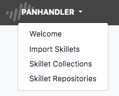
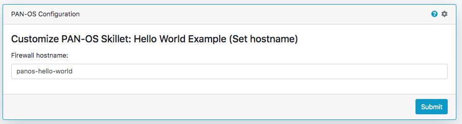

Using Panhandler
================

Once installed and running, use your web browser to access panhandler.

Access the web portal
---------------------

For your local device:

    http://localhost:80  (for a standard web port)

    http://localhost:9999 (using a defined port, eg. 9999)

The default username and password is: `paloalto` and `panhandler`

Set the Configuration Target
----------------------------

Before choosing skillets to load, set the configuration target IP and username/password credentials. This stores the
device credentials to be used for API access.

Jump to :ref:`environments` to set the environment.

Choose Skillets to View by Category
-----------------------------------

From the main panhandler menu, select `Templates Library` to see a list of skillets to load.

Hit `Go` for the category of skillets required. Key categories include PAN-OS, Panorama, GPCS, and Templates for simple
text render to screen.

Select the Template to Load
---------------------------

A list of templates will be available to load into your device. Select the desired item and enter the form data.

The final form will be the target information for API config loading. Confirm the correct values and submit.

.. Warning::
    Validate the device type and software version matches the skillet. For example, you will get errors if trying
    to load a Panorama template into a firewall. There are also cases where you cannot mix sofware versions and
    loading a v8.1 configuration into a v8.0 device will result in errors.

.. Warning::
    Some templates may have dependencies requiring elements to be previously loaded into the system or from other templates.
    Examples may be certificates, security objects, log forwarding profiles, etc. Check template documentation and look
    for any specific dependencies.

Once the load has completed, you can select another template to load to the same device or choose another Environment to
load a configuration to another device.

