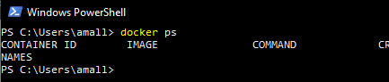
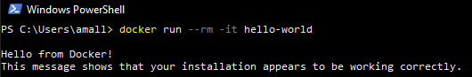
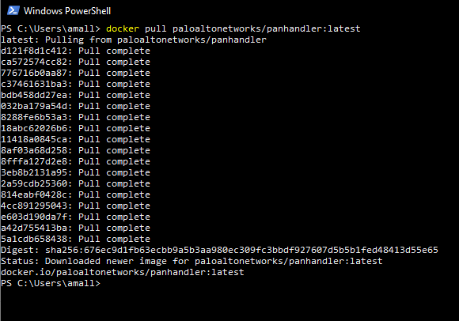
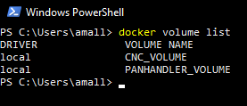
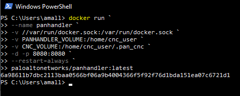
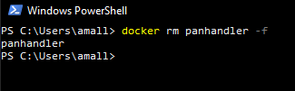

.. _Windows:

Windows Installation
====================

Running panhandler on Windows is possible through docker. The most reliable setup method at this time is to run docker
commands directly through PowerShell backed by WSL 2. This process will require multiple reboots so plan accordingly.
Other installation methods may not provide appropriate access to the docker daemon from the running panhandler
container resulting in certain skillet types not functioning.

Install WSL 2
-------------

Begin by installing WSL 2. Microsoft has good documentation on how to do this here:

https://docs.microsoft.com/en-us/windows/wsl/install-win10

If unsure about a Linux distribution to use, choose the latest Ubuntu. Verify you can access WSL 2 before continuing.
 
Install Docker Desktop
-----------------------
 
After WSL 2 functionality is verified, install the latest Docker Desktop for Windows using the following tutorial from
docker.

https://docs.docker.com/docker-for-windows/install/

During the install, ensure the following settings: 
    - Use the WSL2 based engine, using "Hyper-V" may lead to some known problems
    - Start Docker Desktop when you login, it will allow panhandler to auto start on boot
    - DO NOT select "Expose daemon on tcp://localhost:2375 without TLS"
    - DO NOT select "Enable experimental features"
    - DO NOT enable "Kubernetes"

Unless the installer states otherwise, these settings can be updated by right clicking the docker icon in your system
tray in the bottom right of your Windows screen and selecting "Settings".

Although WSL 2 is required for operation, you will not be using WSL 2 to talk to docker. Open PowerShell and type
"*docker ps*" to verify your docker cli is working and able to talk to the docker daemon. You should see output similar
to this with no errors. This has to be working before you can proceed.

Another good test to perform to ensure docker is running fine is to run the docker "Hello world" image. From PowerShell
type this command:

.. code-block:: powershell

  docker run --rm -it hello-world

You should get an output similar to this:

Install Panhandler
------------------

At this point, you are ready to install and start panhandler. In PowerShell, issue this command to pull down the latest
panhandler image.

.. code-block:: powershell 

  docker pull paloaltonetworks/panhandler:latest

This will take a minute, but you should get output similar to this:

With the image downloaded, all that's left to do is create the volumes and start panhandler. Docker volumes are virtual
storage entities that provides a way to upgrade the image without losing app data. Create the volumes by running these commands:

.. code-block:: powershell

  docker volume create CNC_VOLUME
  docker volume create PANHANDLER_VOLUME

You can verify the volumes have been created by running this command and checking the output matches to the image below:

.. code-block:: powershell

  docker volume list

Now you can start panhandler by coping this entire command block into PowerShell. This command sets a **restart policy**
of *always*, which ensures panhandler will restart with your computer and always run unless you stop it.

.. code-block:: powershell

  docker run `
      --name panhandler `
      -v //var/run/docker.sock:/var/run/docker.sock `
      -v PANHANDLER_VOLUME:/home/cnc_user `
      -v CNC_VOLUME:/home/cnc_user/.pan_cnc `
      -d -p 8080:8080 `
      --restart=always `
      paloaltonetworks/panhandler:latest

That command will result in a long hash that will serve as the ID for the container, but you can still reference it
with the name "*panhandler*".

After a few seconds, you should be able to access panhandler in your web browser by browsing to:

http://localhost:8080/

The installation process is now complete.

Stopping and Starting Panhandler
--------------------------------

If you wish to stop panhandler from running until you restart it, you can do so with the PowerShell command:

.. code-block:: powershell

  docker stop panhandler

Likewise, this process can be restarted with the command:

.. code-block:: powershell

  docker start panhandler

Upgrading Panhandler
--------------------

Only one more command is required to upgrade panhandler. The process is to delete the old container, update the image,
and start a new container.

You can delete the old container, running or stopped, with this command:

.. code-block:: powershell

  docker container rm panhandler -f

You then can use the 'docker pull' and 'docker run' commands exactly as they are above to download a newer panhandler
image and start it. The volumes you created earlier will be still be available and assigned to the new container if
you use the commands as they are.

Troubleshooting Windows Install
-------------------------------

If you run into either of the following errors when trying to install a Linux distribution: 

.. code-block::

  Installing, this may take a few minutes...
  WslRegisterDistribution failed with error: 0x80370102
  Error: 0x80370102 The virtual machine could not be started 
      because a required feature is not installed. 
  
or when trying to run the Docker Desktop GUI: 
  
.. code-block::

  Hardware assisted virtualization and data execution protection
  must be enabled in BIOS.  
  
After verifying that virtualization is enabled in BIOS by opening *Task Manager* > *Performance* > *Virtualization*,
please attempt the following steps.

1. If the Windows' Hyper-V feature is totally disabled or not installed, enable Hyper-V by 
   opening the PowerShell as administrator and running the following command: 
 
.. code-block:: powershell
  
  dism.exe /Online /Enable-Feature:Microsoft-Hyper-V /All
  
2. If the Windows' Hyper-Vfeature is enabled and not working, enable Hypervisor with the 
   following command and restart your system:
     
.. code-block:: powershell

  bcdedit /set hypervisorlaunchtype auto

3. If the problem persists probably Hyper-V on your system is corrupted, so turn off all Hyper-V
   related Windows' features under *Control Panel* > *Programs* > *Windows Features*. Restart
   your system and attempt to enable Hyper-V again. 
     
This troubleshooting guide was found from: 

  https://stackoverflow.com/questions/39684974/docker-for-windows-error-hardware-assisted-virtualization-and-data-execution-p 
  

